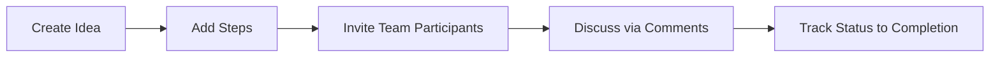

<h1 align="center">Idea</h1>

<p align="center">
	A Laravel collaboration app for capturing ideas, tracking progress, and working as a team.
</p>

<p align="center">
	
	
	
	
	
</p>

## About

Idea started as a project inspired by Laracasts learning material, then evolved with my own improvements in structure, usability, and feature flow.

## Product Snapshot

| Area | Description |
| --- | --- |
| Ideas | Capture and manage ideas with clear statuses. |
| Steps | Break ideas into actionable steps. |
| Teamwork | Collaborate with participants and comments. |
| UX | Keep interactions fast and focused for daily use. |

## Workflow Overview



## Tech Stack

- Laravel
- PHP
- Blade
- Tailwind CSS
- Pest

## Local Development

### Requirements

- PHP 8.4+
- Composer
- Node.js + npm
- A Laravel-supported database

### Setup

```bash
composer install
npm install
cp .env.example .env
php artisan key:generate
php artisan migrate --seed
npm run dev
```

## Testing

```bash
php artisan test --compact
```

## Security and Privacy Note

This README intentionally stays high-level and does not expose sensitive operational or environment-specific details.

## License

This project is open-source and available under the MIT License.
